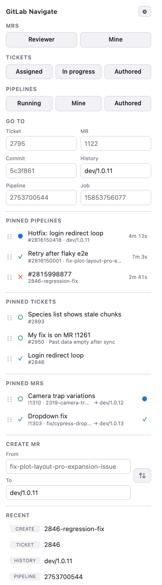

# GitLab Navigate

A Chrome and Firefox extension that turns a bare GitLab reference into a tab. Open the
popup, paste a ticket number, MR number, commit hash, or branch name, press Enter.

<picture>
  <source media="(prefers-color-scheme: dark)" srcset="docs/popup-dark.png">
  
</picture>

The screenshots are generated from the real markup by `./tools/screenshot.sh` — see
[Development](#development).

## Install

### Chrome

1. Open `chrome://extensions` and enable **Developer mode**.
2. Click **Load unpacked** and pick this folder.
3. Open the popup and set your GitLab repo URL, e.g.
   `https://gitlab.com/ternandsparrow/paratoo-fdcp`.

The popup is also bound to **Cmd+Shift+G** (**Ctrl+Shift+G** on Windows/Linux). Change
it at `chrome://extensions/shortcuts`.

### Firefox

1. Open `about:debugging#/runtime/this-firefox`.
2. Click **Load Temporary Add-on** and pick this folder's `manifest.json`.
3. Set your GitLab repo URL as above.

Three Firefox-specific things to know:

- Temporary add-ons unload when Firefox closes, so those steps repeat each session. For
  a permanent install, sign the folder as an unlisted add-on (`npx web-ext sign`) and
  install the resulting `.xpi`.
- The default shortcut collides with Firefox's built-in find-previous binding. Rebind it
  at `about:addons` > gear > **Manage Extension Shortcuts**.
- Loading logs one warning, `Reading manifest: Warning processing key`. That is Firefox
  ignoring the Chrome-only `key` property (see [Settings survive
  updates](#settings-survive-updates)). It is a warning, not an error, and nothing
  breaks.
- Minimum versions are Firefox **140** on desktop and **142** on Android. Both floors
  come from `data_collection_permissions`, which desktop gained in 140 and Android in
  142 — not from anything the extension itself does. 140 is deliberate: it is the
  current ESR, so the extension installs on ESR machines.

## MRs

Two buttons under the **MRs** heading, each opening a filtered MR list (open, newest
first, 100 per page):

- **Reviewer** — MRs where you're requested as a reviewer (`reviewer_username`).
- **Mine** — MRs assigned to you (`assignee_username`), i.e. the ones you have to deal
  with.

**Mine** is assignee-filtered rather than a true "authored or assigned" union because
GitLab can't express that in a URL: filter params AND together (`?author_username=you&
assignee_username=you` means *both*, which is narrower), the MR list has a `not` hash
but no `or` hash, and `scope` accepts only one of `created_by_me` / `assigned_to_me` /
`reviews_for_me` / `all`. Since GitLab's new-MR form assigns the author by default,
assignee covers your own MRs in practice — the one gap is an MR you opened and
assigned to somebody else.

Both need your GitLab username, set once in settings. Clicking either before the repo
URL or username is configured opens settings with an inline error instead of failing
quietly.

## Tickets

Three buttons under the **Tickets** heading, each opening GitLab's work-item list
filtered to your username, newest first, 100 per page:

- **Assigned** — work items assigned to you (`assignee_username[]`).
- **In progress** — assigned to you *and* status `In progress` (`status`).
- **Authored** — work items you opened (`author_username`).

"In progress" is GitLab's native work-item **Status** field, not a label — GitLab's own
issue `state` is only `opened`/`closed`, so it can't express this. Status is an Ultimate
feature (generally available in 18.4); on a tier without it that button returns
everything assigned to you instead of erroring.

All three use `state=all`, so closed work items are included. Like the MR buttons, they
need your GitLab username from settings.

## Pipelines

Three buttons under the **Pipelines** heading, all using `scope=all` so they span every
ref rather than just the default branch:

- **Running** — every running pipeline in the repo (`status=running`). Needs only the
  repo URL, so it works before you've set a username.
- **Mine** — running pipelines you triggered (`status=running` + `username`).
- **Authored** — every pipeline you triggered, in any state. No `status` filter, so
  this is a superset of **Mine**.

## Go to

Given the base URL above, each box under **Go to** takes a bare reference. They are
laid out two per row, each with its name above the box and an example inside it:

| Box      | You type       | It opens                                  |
|----------|----------------|-------------------------------------------|
| Ticket   | `2795`         | `.../paratoo-fdcp/-/work_items/2795`      |
| MR       | `1122`         | `.../paratoo-fdcp/-/merge_requests/1122`  |
| Commit   | `5c3f861…`     | `.../paratoo-fdcp/-/commit/5c3f861…`      |
| History  | `dev/1.0.11`   | `.../paratoo-fdcp/-/commits/dev%2F1.0.11/`|
| Pipeline | `2753700544`   | `.../paratoo-fdcp/-/pipelines/2753700544` |
| Job      | `15853756077`  | `.../paratoo-fdcp/-/jobs/15853756077`     |

Pipeline and job ids are both bare numbers with no way to tell them apart from the id
alone, so they get their own boxes rather than sharing one.

History is pre-filled with your default MR target branch (the same one that seeds
Create MR's **To** box), since that's the branch you check most often — still fully
editable for a one-off.

Input is forgiving everywhere: `#2795` and `!1122` work, commit hashes may be 7–40 hex
characters in any case, branch names may carry a leading `origin/` or `refs/heads/`,
and pasting a full GitLab URL into any box just opens that URL.

## Pinned pipelines

Start several pipelines, pin them, and check them all from the popup instead of loading
the pipelines page each time. Each row shows a status glyph, the pipeline number, its
branch, and elapsed time — running pipelines count up while the popup is open. Click a
row to open the pipeline; hover it to reveal **✎** (note) and **✕** (unpin).

To pin: open a pipeline page (`.../-/pipelines/2816150418`) and the popup shows **Pin
this pipeline**.

Drag the grip handle (⠿) on the left of a row to reorder it — a line shows where it will
land. Only the handle is draggable, so dragging never conflicts with clicking the row to
open it. Order persists across popup opens.

**Notes.** Give a pipeline a short note (up to 80 characters) and it becomes the row's
headline, with the pipeline number and branch on the line below — handy once several
pipelines are pinned. Pinning opens the note box straight away (Esc or click away to
skip); later, hover the row and click ✎. Enter or clicking away saves, Esc cancels, and
saving an empty note removes it. Notes are stored with the pin on this machine and go
away when you unpin.

**On GitLab.** A pinned pipeline's note also appears in GitLab itself: after the big
number on the pipeline's page (`#2866034605  📌 Species list old issue v2`) and after
its number in the pipelines list, so you can tell pipelines apart without opening the
popup. It updates as soon as you edit the note, keeps up as GitLab refreshes the list,
and disappears when you unpin. A small script does this; it runs only on your GitLab
site's pipeline pages (`…/-/pipelines…`) and is switched on by the popup once you've
granted GitLab access. After updating the extension, open the popup once for notes to
reappear on GitLab. It covers the GitLab site in your repo URL setting; pipelines pinned
from a different GitLab site show their note in the popup only.

Status is refreshed each time the popup opens. Cached values appear instantly and are
replaced when the refresh lands, so the list still reads sensibly offline.

### How it reads pipeline status

The pinned lists and the runner badges are the only features that talk to the GitLab
API: the popup reads `/api/v4/projects/:path/pipelines/:id`, `…/issues/:id` and
`…/merge_requests/:iid`, and the pipeline-page script reads `…/pipelines/:id/jobs`. They
authenticate with the `_gitlab_session` cookie your browser already has, so there is
**no token to create, and none is stored**.

That needs permission to make requests to your GitLab instance, which is declared as an
*optional* permission and requested at runtime the first time you pin — your browser
will ask, naming only that one host. Nothing is requested at install time, and the rest
of the extension keeps working without it. If you decline, pinning still records the
pipeline and clicking still opens it; the status and branch just stay blank until you
grant access.

The same access lets the popup switch on the pipeline-page script (notes and runner
badges), which adds the `scripting` permission (Chrome shows no warning for it). If you remove the access in
your browser settings, the browser stops running that script too.

## Pinned tickets

Keep the tickets you're working on one click away. Open a ticket (`…/-/work_items/2893`
or `…/-/issues/2893`) and the popup shows **Pin this ticket**. Each pinned ticket shows
its GitLab title and whether it's open (○) or closed (✓), refreshed each time the popup
opens. Add a note with ✎ and it replaces the title as the headline, with the number and
title on the line below. Drag to reorder and ✕ to unpin — the same controls as pinned
pipelines. Up to 10 tickets.

The title comes through the same GitLab access pinned pipelines use (see [How it reads
pipeline status](#how-it-reads-pipeline-status)). GitLab's work-item Status field ("In
progress") is only available through its GraphQL API, so it isn't shown.

## Pinned MRs

Open a merge request (`…/-/merge_requests/1303`, or its Changes, Commits or Pipelines
tab) and the popup shows **Pin this MR**. Each pinned MR shows whether it's open (○),
merged (✓) or closed (✕), its title, `!1303 · source → target`, and on the right the
status of its latest pipeline. Long source branches are shortened so the target stays
visible; hover for the full names. Notes, drag-to-reorder and unpin work as for
pipelines and tickets. Up to 10 MRs.

## Create MR

Two boxes. **From** takes the source branch; **To** is pre-filled with your default MR
target branch and can be edited for a one-off. Press Enter in either and GitLab's
new-merge-request page opens with both ends already selected — no re-picking the target
away from `main` every time.

The **⇅** button between them swaps From and To. That covers the reverse direction:
with `dev/1.0.12` as your default target, one click makes it the *source* so you can
diff it against a feature branch.

Both ends accept a leading `origin/` or `refs/heads/`, so pasting straight from
`git branch -a` works.

## Recent

The last 8 places you visited are listed under **Recent** and are one click away.
Hover (or tab to) an entry to reveal a 🗑 button that removes just that one. The type
badge sits in a fixed-width column so every value lines up at the same left edge.

## Runner badges

On your GitLab site's pipelines list and pipeline pages, each pipeline gets a grey badge
naming the runner it targets, such as `perentie-runner`, next to GitLab's own `latest` /
`branch` badges.

GitLab doesn't keep the inputs a pipeline was started with, so a `RUNNER_TAG` input
can't be read back, but it does record each job's runner tags. The badge shows the tags
that every tagged job in the pipeline carries; untagged jobs, which run on shared
runners, don't count. If your jobs also share a tag that isn't a runner, such as
`cypress`, list it under **Ignore job tags** in settings and it's dropped.

The page script reads the jobs with your existing GitLab login
(`/api/v4/projects/:path/pipelines/:id/jobs`, first 100 jobs), so there's no token to
set up. A pipeline's tags never change, so each one is fetched once and remembered (the
newest 500 are kept). Child pipelines aren't followed.

## Swap branches on a "new merge request" page

If GitLab's active tab is already on a `.../-/merge_requests/new?...` page (typically
because you got there via Create MR), the popup shows a **Swap
source/target branches** button, directly beneath the Create MR section. Click it and that tab reloads with source and
target swapped — handy when GitLab reports "these branches already have an open
merge request" and you actually meant it the other way round.

This reads and rewrites the tab's URL only; it doesn't touch the page's DOM, so it
can't break when GitLab changes their UI.

## Settings

The gear button holds four fields:

- **GitLab repo URL** — paste any page from the repo and everything from `/-/` onward
  is stripped, so `…/paratoo-fdcp/-/merge_requests/1122` is stored as
  `…/paratoo-fdcp`. Self-hosted GitLab instances work; the URL just has to be http(s).
- **Default MR target branch** — used by the Create MR box, e.g. `dev/1.0.11`.
- **Your GitLab username** — used by the MRs, Tickets, and Pipelines > Mine buttons,
  e.g. `nuwan-tern`.
- **Ignore job tags** — job tags that aren't runners, left out of the
  [runner badges](#runner-badges), e.g. `cypress`. Separate several with commas or
  spaces; leave it empty to ignore nothing.

All four are kept in `chrome.storage.sync`, so they follow your Chrome profile. In
Firefox the same storage follows your Firefox Account; without one signed in it behaves
as local storage and stays on that machine. Recent history is kept in
`chrome.storage.local`.

### Settings survive updates

`manifest.json` carries a `key` that pins the extension ID. Without it, an unpacked
extension's ID is derived from its folder path, so re-adding it via **Load unpacked**
(or moving the folder) produces a different ID — and therefore an empty settings
bucket. With the key pinned, the ID is the same everywhere, so your repo URL, target
branch, and username persist across reinstalls, folder moves, and other machines.

Reloading in place with the ⟳ button on `chrome://extensions` never cleared settings;
removing and re-adding did.

## Development

No build step. Vanilla JS, Manifest V3, no background service worker.

One codebase covers both browsers. Firefox aliases the `chrome.*` namespace and, under
Manifest V3, returns promises from it, so every `chrome.tabs.*` and `chrome.storage.*`
call works unchanged with no polyfill. The only Firefox-specific manifest entry is
`browser_specific_settings.gecko`, which supplies the add-on ID that Manifest V3
requires. Chrome ignores that key, Firefox ignores `key`.

```
bun test        # unit tests for lib/parse.js
```

`lib/parse.js` is pure reference-to-URL translation with no Chrome dependencies;
`popup.js` holds all DOM and extension API wiring; `lib/storage.js` owns the storage
keys.

```
npx web-ext lint    # validates the manifest against Firefox/AMO rules
npx web-ext run     # launches a scratch Firefox with the extension loaded
```

`web-ext-config.cjs` keeps `tools/`, `docs/`, `test/` and the Markdown out of the
packaged add-on — they belong in the repo, not in the `.xpi`.

### Screenshots

`./tools/screenshot.sh` re-renders `docs/popup-light.png` and `docs/popup-dark.png`
from `popup.html` and `popup.css` using headless Chrome. **Run it after any change to
the popup's markup or styles, and commit the updated PNGs**, so the README never shows
a stale UI.

It renders the real files rather than a mock-up: the popup's JavaScript is stripped
(it needs the `chrome.*` APIs) and the Recent list is injected as static markup
mirroring what `renderHistory()` builds. Headless Chrome ignores
`--blink-settings=preferredColorScheme` and inherits the host appearance, so the script
reads both palettes out of `popup.css` and re-applies the wanted one as a plain `:root`
block — the values still come from the stylesheet, so the screenshots cannot drift
from it.
